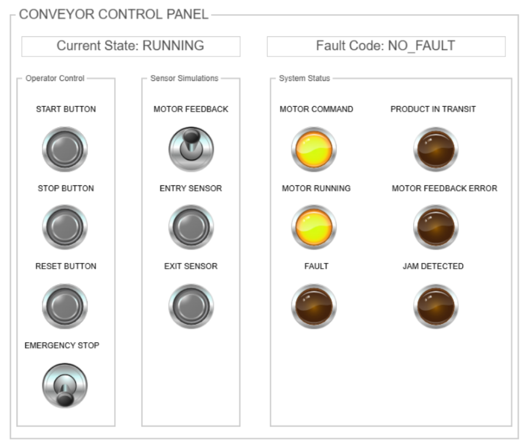
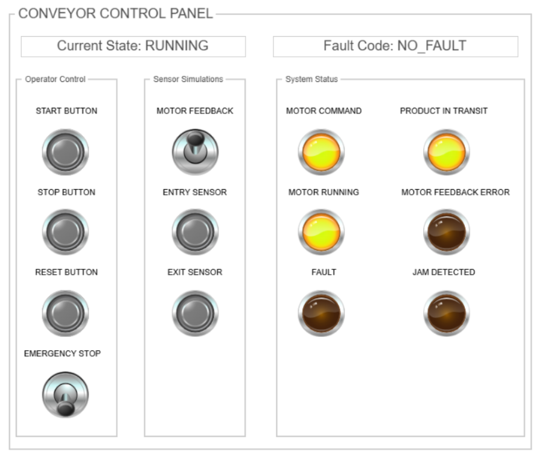
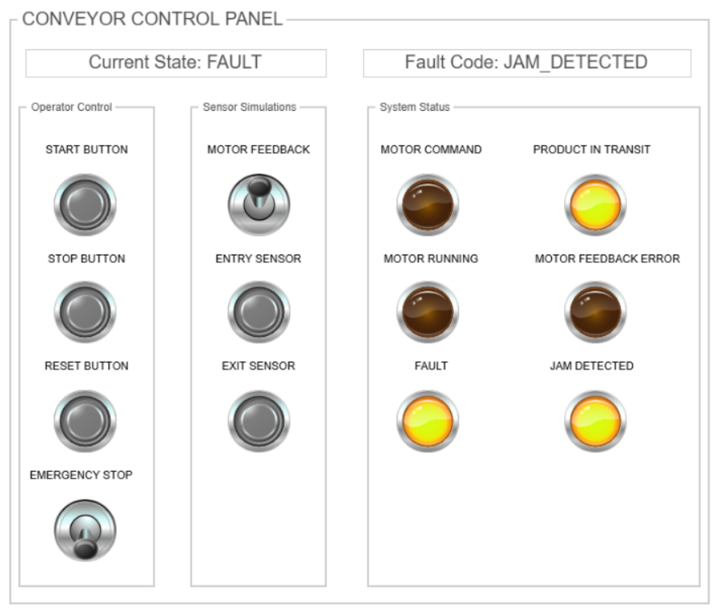
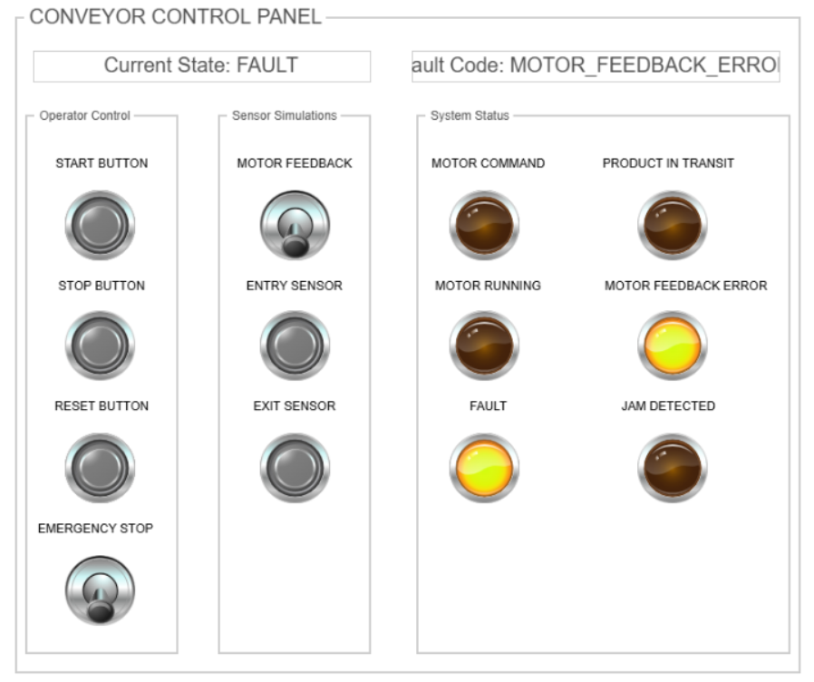
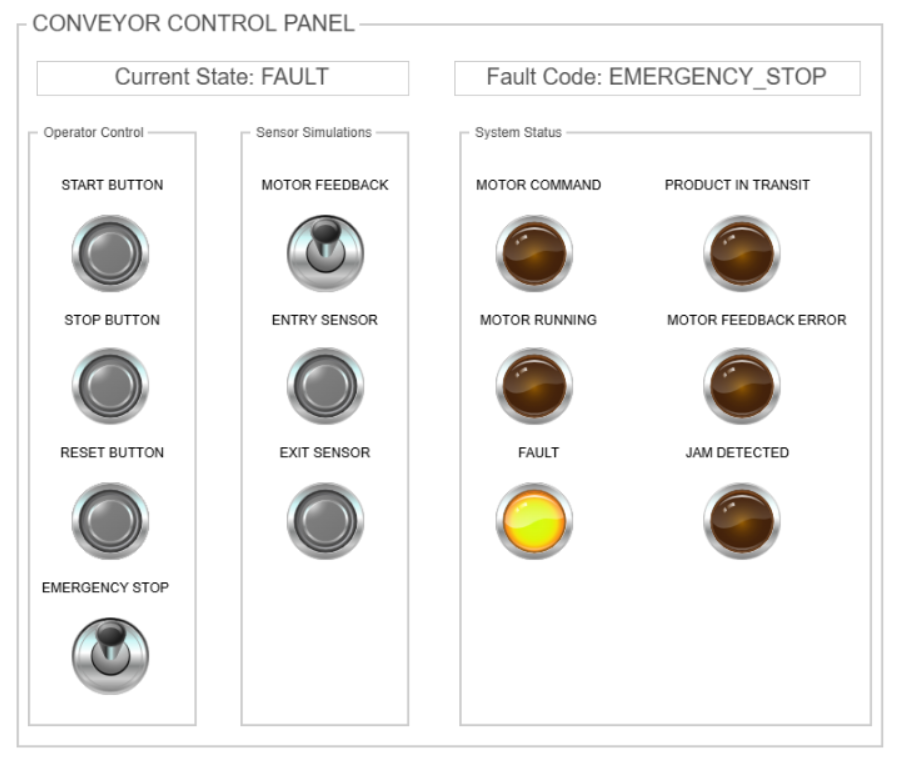

# CODESYS Conveyor Control

A conveyor control simulation developed in CODESYS using IEC 61131-3 Structured Text.

The project demonstrates state-based machine control, motor feedback supervision, product tracking, jam detection, emergency stop handling, and HMI-based input simulation.

## Project Overview

The conveyor is controlled through a state machine with four operating states:

- `STOPPED`
- `STARTING`
- `RUNNING`
- `FAULT`

The control logic separates machine operation, fault detection, product tracking, and visualization into structured data types and function blocks.

The project was developed without physical hardware. Motor feedback and conveyor sensors are simulated through the HMI.

## Main Features

- State machine-based conveyor control
- Start, stop, reset, and emergency stop handling
- Motor command and motor feedback supervision
- Motor feedback timeout detection
- Entry and exit sensor processing
- Product-in-transit tracking
- Conveyor jam detection
- Latched jam fault handling
- Fault-specific HMI indicators
- Safe motor shutdown during faults
- Modular function block structure

## Operating Behavior

### STOPPED

The conveyor motor command is disabled.

A start command moves the system to `STARTING`, provided that the emergency stop is not active.

### STARTING

The motor command is enabled, but the conveyor is not yet considered operational.

The system waits for motor feedback.

If feedback is received, the state changes to `RUNNING`.

If feedback is not received within 5 seconds, the system enters `FAULT` with a `MOTOR_FEEDBACK_ERROR`.

The operator can cancel the startup sequence using the Stop button.

### RUNNING

The motor command remains active and motor operation has been confirmed through the feedback signal.

Entry and exit sensor events are processed only while conveyor operation is confirmed.

If motor feedback is temporarily lost, the system returns to `STARTING` and waits for feedback again.

If a tracked product does not reach the exit sensor within 10 seconds of active conveyor operation, a jam fault is generated.

### FAULT

The motor command is disabled immediately.

The active fault is stored in `eFault` and displayed on the HMI.

The system can only be reset after the emergency stop signal has been released.

After a successful reset, the system returns to `STOPPED`.

## Product Tracking

The project tracks whether a product is located between the entry and exit sensors.

When the entry sensor detects a rising edge:

```text
xProductInTransit = TRUE
```

When the exit sensor detects a rising edge:

```text
xProductInTransit = FALSE
```

The product tracking information is not cleared automatically when the conveyor stops, loses motor feedback, or enters a fault state.

This represents a physical product that may still remain on the conveyor after the motor has stopped.

Sensor events are ignored while conveyor operation is not confirmed. Existing product tracking information is preserved until the product reaches the exit sensor.

## Jam Detection

Jam monitoring is implemented in `FB_JamDetector`.

The jam timer operates only when:

- The conveyor state is `RUNNING`
- Motor feedback is active
- No motor feedback error exists
- A product is currently in transit
- No jam fault is already active

If the product does not reach the exit sensor within 10 seconds, `xJamDetected` becomes active.

The jam signal is latched and remains active until an accepted fault reset occurs.

Resetting the jam fault does not clear the product tracking information. If the product is still located on the conveyor, it remains tracked after the reset.

## Motor Feedback Monitoring

Motor feedback supervision is implemented in `FB_MotorFeedbackMonitor`.

The timer starts when:

```text
Motor Command = TRUE
Motor Feedback = FALSE
```

If feedback is not received within 5 seconds, the function block generates an error.

The motor feedback error follows the feedback timer output and resets automatically when the monitoring condition is no longer active.

The system-level fault remains stored separately in `eFault` until the operator resets the system.

## Fault Types

The project supports the following fault codes:

| Fault | Description |
|---|---|
| `NO_FAULT` | No active fault |
| `EMERGENCY_STOP` | Emergency stop input is active |
| `JAM_DETECTED` | Product did not reach the exit sensor within the allowed time |
| `MOTOR_FEEDBACK_ERROR` | Motor feedback was not received within the timeout |

Emergency stop handling has global priority and forces the system into the `FAULT` state from any operating state.

## Function Blocks

### FB_MotorFeedbackMonitor

Monitors whether motor feedback is received after a motor command.

### FB_JamDetector

Tracks a product between the entry and exit sensors and detects a timeout condition.

## HMI Simulation

The HMI is used both for operator control and for input simulation.

Operator controls:

- Start
- Stop
- Reset
- Emergency Stop

Simulated field inputs:

- Motor Feedback
- Entry Sensor
- Exit Sensor

The Motor Feedback switch represents a simulated field signal. It is not controlled automatically by the PLC program.

This allows the following conditions to be tested manually:

- Normal motor startup
- Missing motor feedback
- Motor feedback loss during operation
- Product entry and exit
- Conveyor jam
- Emergency stop activation

## HMI Screenshots

### Normal Operation



### Product in Transit



### Jam Fault



### Motor Feedback Fault



### Emergency Stop



Additional state screenshots are available in the `docs` directory.

## Test Scenarios

The following scenarios were tested through the HMI:

1. Normal startup and transition to `RUNNING`
2. Normal stop from `STARTING`
3. Normal stop from `RUNNING`
4. Motor feedback timeout during startup
5. Motor feedback loss during operation
6. Product entry and exit tracking
7. Jam detection after product timeout
8. Product tracking preservation after Stop
9. Product tracking preservation after Emergency Stop
10. Jam reset without clearing the tracked product
11. Emergency stop activation from each operating state
12. Safe motor shutdown during all fault conditions

## Design Limitations

This project is intended as a control logic and HMI simulation example.

The current implementation assumes that only one product is tracked between the entry and exit sensors at a time.

Physical field devices, electrical safety circuits, safety relays, drive communication, and hardware I/O mapping are outside the scope of this simulation.

In a real industrial application, the emergency stop function must be implemented using appropriate safety-rated hardware and must not rely only on standard PLC software.

## Software

- CODESYS Development System
- IEC 61131-3 Structured Text
- CODESYS Visualization